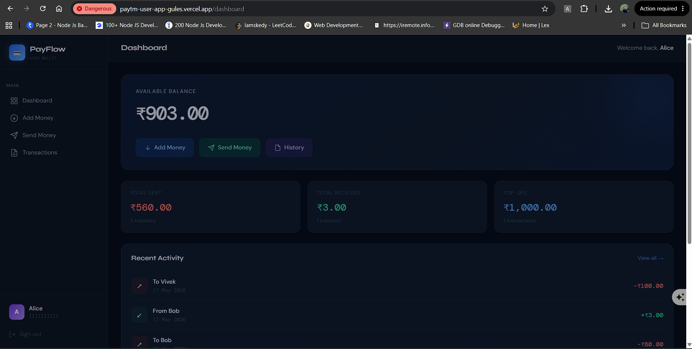
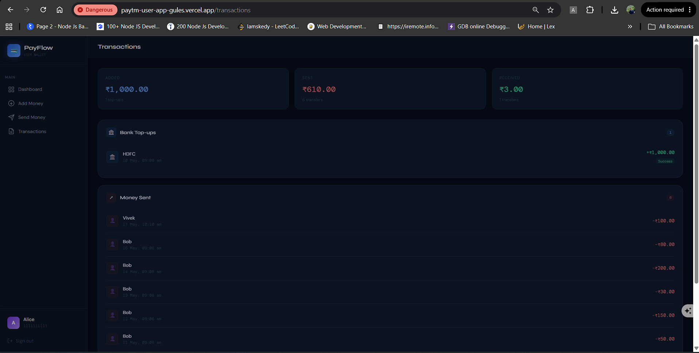
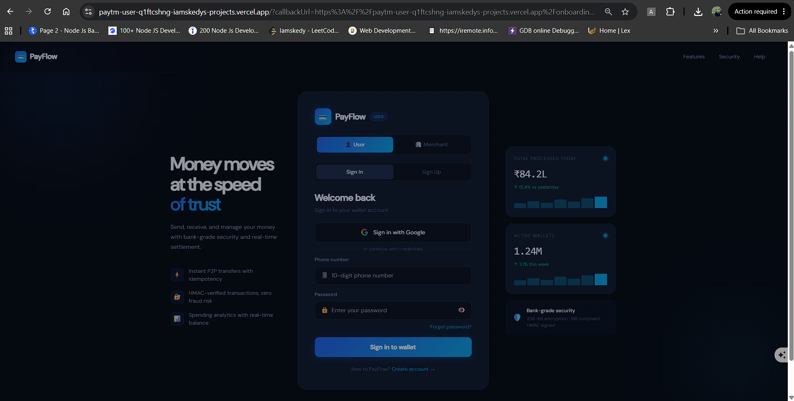
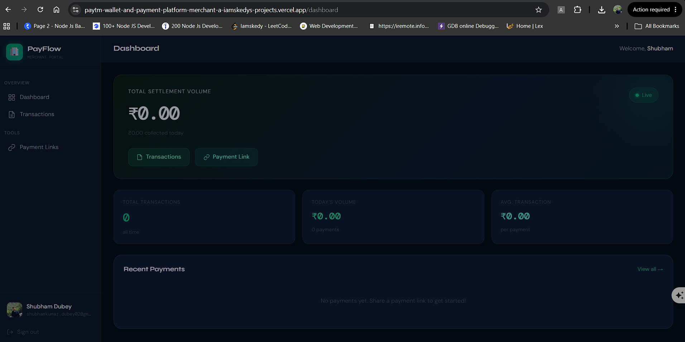
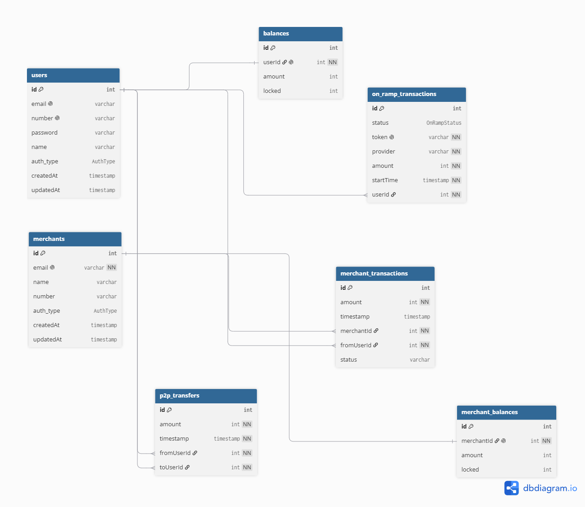

# Paytm Wallet & Payment Platform

[](https://paytm-user-q1ftcshng-iamskedys-projects.vercel.app/)
[](https://paytm-wallet-and-payment-platform-merchant-a-iamskedys-projects.vercel.app/)

A full-stack, production-inspired **digital wallet and payment platform** built as a Turborepo monorepo — mirroring how fintechs structure real codebases. Users can add money via on-ramp transactions, send money peer-to-peer, and pay merchants; merchants get a separate dashboard with their own isolated balance ledger.

> **Why this project?** Most payment clones are toy apps. This one deliberately tackles the hard parts: **balance locking to prevent race conditions**, **atomic P2P transfers**, **separate on-ramp and merchant transaction ledgers**, and **multi-app monorepo orchestration** with shared packages.

---

## Live Screenshots

<table>
  <tr>
    <td align="center"><strong>User Dashboard</strong></td>
    <td align="center"><strong>Add Money</strong></td>
    <td align="center"><strong>Transactions</strong></td>
  </tr>
  <tr>
    <td></td>
    <td></td>
    <td></td>
  </tr>
  <tr>
    <td align="center"><strong>User Login</strong></td>
    <td align="center"><strong>Merchant Dashboard</strong></td>
    <td align="center"><strong>DB Schema</strong></td>
  </tr>
  <tr>
    <td></td>
    <td></td>
    <td></td>
  </tr>
</table>

---

## Architecture Overview

```
paytm-wallet/
├── apps/
│   ├── user-app/          # Next.js — customer-facing wallet (auth, P2P, on-ramp)
│   └── merchant-app/      # Next.js — merchant dashboard (incoming payments, balance)
├── packages/
│   ├── db/                # Prisma schema + migrations (single source of truth)
│   ├── ui/                # Shared React component library
│   └── ...                # ESLint config, TypeScript config
└── turbo.json             # Pipeline: build → lint → dev in parallel
```

Two independent Next.js apps share **one Prisma schema** and **one UI library** — changes to the DB model or design system propagate everywhere without duplication.

---

## System Design


The platform is composed of **5 independent services** inside a Turborepo monorepo, each with a single responsibility:

| Service | Type | Responsibility |
|---|---|---|
| `user-app` | Next.js | Customer-facing wallet — login, dashboard, P2P transfers, add money |
| `merchant-app` | Next.js | Merchant dashboard — incoming payments, balance view |
| `bank-webhook` | Node.js / Cloudflare Workers | Receives async push callbacks from Bank APIs when transfers complete |
| `bank-sweeper` | Node.js | Polls Bank APIs for on-ramp status; updates DB when webhook is not reliable |
| `user-withdrawal-sweeper` | Node.js | Processes pending withdrawal queue from DB and initiates Bank API transfers |

### Service Interactions

```
User ──────────► user-app ──────────────────────────────────┐
                                                             │ Prisma ORM
Merchant ───────► merchant-app ─────────────────────────────┤
                                                             ▼
bank-webhook ◄── Bank APIs ──────────────────────────► PostgreSQL
                     ▲                                       ▲
bank-sweeper ────────┤  poll status / update on_ramp         │
                     │                                       │
user-withdrawal-sweeper ─────── poll + process ─────────────┘
```

### Key Architectural Decisions

**Two-path bank sync (webhook + sweeper)**
The `bank-webhook` handles real-time push callbacks from banks that support it. The `bank-sweeper` actively polls for banks that don't — this dual-path approach ensures no on-ramp transaction is ever stuck in `Processing` indefinitely.

**Cloudflare Workers for webhook handler**
Edge deployment means zero cold starts, global low latency, and natural resilience to traffic spikes during peak payment windows.

**Shared `@repo/db` package**
A single Prisma schema is the source of truth for all 5 services. Schema drift between apps is impossible — a migration runs once and every service picks it up.

**PostgreSQL as the single backbone**
No message queue (Kafka/BullMQ) is used here by design — sweepers poll the DB directly. This keeps the architecture simple and observable at MVP scale, with a clear upgrade path to async queues if throughput demands it.

**Supported Bank APIs**
HDFC · SBI · Axis Bank

---

## Database Schema

The schema is designed around three core financial invariants:
1. **Balance integrity** — the `locked` field prevents double-spends during concurrent transfers
2. **Ledger separation** — user, merchant, and on-ramp transactions never mix
3. **Auditability** — every money movement is a timestamped, immutable row


### Tables at a glance

| Table | Purpose |
|---|---|
| `users` | Wallet customers — email, phone, auth type, credentials |
| `merchants` | Merchant accounts — separate auth, own balance ledger |
| `balances` | User wallet balance with `locked` + `version` fields for concurrency control |
| `merchant_balances` | Merchant balance with same locking pattern |
| `p2p_transfers` | Peer-to-peer send-money log (`fromUserId → toUserId`) with status & description |
| `on_ramp_transactions` | Bank → wallet top-ups via provider token; includes `failureReason` for diagnostics |
| `merchant_transactions` | Wallet → merchant payments (`fromUserId → merchantId`) |

**Key design decisions:**

- `balances.locked` acts as a soft lock during in-flight transactions — available balance is always `amount - locked`, preventing overdrafts under concurrent requests
- `balances.version` supports optimistic locking as an alternative to pessimistic `SELECT FOR UPDATE`
- All amounts stored in **paise** (smallest unit) to avoid floating-point precision issues
- `on_ramp_transactions.token` is a unique idempotency key — prevents double-crediting on duplicate webhook callbacks
- `p2p_transfers.status` (PENDING → SUCCESS | FAILED) enables safe recovery from mid-transfer crashes

### Updated DBML

```dbml
Table users {
  id          int         [pk, increment]
  email       varchar     [unique]
  phoneNumber varchar     [unique]
  password    varchar
  name        varchar
  auth_type   AuthType
  createdAt   timestamp
  updatedAt   timestamp
}

Table merchants {
  id          int         [pk, increment]
  email       varchar     [unique, not null]
  name        varchar
  phoneNumber varchar
  auth_type   AuthType
  createdAt   timestamp
  updatedAt   timestamp
}

Table balances {
  id        int          [pk, increment]
  userId    int          [unique, not null, ref: > users.id]
  amount    int          [note: 'stored in paise']
  locked    int          [default: 0]
  version   int          [default: 0, note: 'optimistic locking']
  currency  varchar(3)   [default: 'INR']
}

Table merchant_balances {
  id          int        [pk, increment]
  merchantId  int        [unique, not null, ref: > merchants.id]
  amount      int        [note: 'stored in paise']
  locked      int        [default: 0]
  version     int        [default: 0, note: 'optimistic locking']
  currency    varchar(3) [default: 'INR']
}

Table on_ramp_transactions {
  id            int           [pk, increment]
  status        OnRampStatus  [not null]
  token         varchar       [unique, not null, note: 'idempotency key']
  provider      varchar       [not null]
  amount        int           [not null, note: 'stored in paise']
  startTime     timestamp     [not null]
  updatedAt     timestamp     [not null]
  failureReason varchar
  currency      varchar(3)    [default: 'INR']
  userId        int           [not null, ref: > users.id]
}

Table p2p_transfers {
  id          int        [pk, increment]
  amount      int        [not null, note: 'stored in paise']
  status      varchar    [not null, note: 'PENDING | SUCCESS | FAILED']
  description varchar
  timestamp   timestamp  [not null]
  updatedAt   timestamp  [not null]
  currency    varchar(3) [default: 'INR']
  fromUserId  int        [not null, ref: > users.id]
  toUserId    int        [not null, ref: > users.id]
}

Table merchant_transactions {
  id          int        [pk, increment]
  amount      int        [not null, note: 'stored in paise']
  status      varchar    [not null]
  description varchar
  timestamp   timestamp  [not null]
  updatedAt   timestamp  [not null]
  currency    varchar(3) [default: 'INR']
  merchantId  int        [not null, ref: > merchants.id]
  fromUserId  int        [not null, ref: > users.id]
}

Enum AuthType {
  Google
  Credentials
}

Enum OnRampStatus {
  Success
  Failure
  Processing
}
```

---

## Tech Stack

| Layer | Technology |
|---|---|
| **Monorepo** | Turborepo with pnpm workspaces |
| **Frontend** | Next.js 14 (App Router), TypeScript, Tailwind CSS |
| **Backend** | Next.js API Routes / Server Actions |
| **Auth** | NextAuth.js (credentials + extensible to OAuth) |
| **Database** | PostgreSQL via Prisma ORM |
| **Shared UI** | Internal `@repo/ui` component library |
| **Package Manager** | pnpm |

---

## Getting Started

### Prerequisites

- Node.js ≥ 18
- pnpm ≥ 8
- PostgreSQL instance (local or cloud)

### 1. Clone & install

```bash
git clone https://github.com/iamskedy/Paytm-Wallet-and-Payment-Platform.git
cd Paytm-Wallet-and-Payment-Platform
pnpm install
```

### 2. Configure environment

Each app has its own `.env`. Copy the examples:

```bash
cp apps/user-app/.env.example apps/user-app/.env
cp apps/merchant-app/.env.example apps/merchant-app/.env
```

Set your `DATABASE_URL` and `NEXTAUTH_SECRET` in both files.

### 3. Set up the database

```bash
# Run from the db package — applies schema to your Postgres instance
cd packages/db
npx prisma migrate dev
npx prisma generate
```

### 4. Run

```bash
# From repo root — starts both apps in parallel via Turborepo
pnpm dev
```

| App | URL |
|---|---|
| User app | http://localhost:3000 |
| Merchant app | http://localhost:3001 |

---

## Core Flows

### P2P Transfer (User → User)
1. Sender initiates transfer
2. System checks `balance.amount - balance.locked >= transferAmount`
3. `locked` is incremented atomically on sender
4. Debit sender, credit recipient inside a single Prisma transaction
5. `locked` decremented, row written to `p2p_transfers` with status `SUCCESS`
6. On failure at any step, status set to `FAILED` and `locked` released

### On-Ramp (Bank → Wallet)
1. User selects provider and amount
2. Row created in `on_ramp_transactions` with status `Processing` and a unique provider `token`
3. Provider webhook hits `bank-webhook` handler; idempotency checked against `token`
4. On `Success`, `balances.amount` incremented; on `Failure`, `failureReason` populated

### Merchant Payment
1. User pays merchant from wallet
2. Deducts from `balances`, writes to `merchant_transactions` with status
3. Increments `merchant_balances.amount`

---

## Project Highlights

- **Monorepo at scale** — two production apps, one DB schema, one UI lib, zero duplication
- **Concurrency-safe balances** — `locked` field + `version` for both pessimistic and optimistic locking patterns
- **Idempotent on-ramp** — `token` unique key prevents double-crediting from duplicate webhook callbacks
- **Dual auth** — users and merchants are separate entities with separate session contexts
- **Type-safe end-to-end** — Prisma-generated types flow from DB through API to UI with no `any`
- **Turborepo pipeline** — `turbo build` builds only what changed; CI is fast by default
- **Paise-based amounts** — all monetary values stored as integers in smallest unit, no floating-point errors

---

## Roadmap

- [ ] Webhook handler for on-ramp provider callbacks
- [ ] Transaction pagination and search
- [ ] Rate limiting on transfer endpoints
- [ ] Docker Compose for local Postgres + app setup
- [ ] E2E tests with Playwright
- [ ] Retry logic with exponential backoff on sweeper jobs

---

## Author

**Shubham** — Backend Engineer  
[GitHub](https://github.com/iamskedy) · [LinkedIn](https://linkedin.com/in/shubhamdubey)